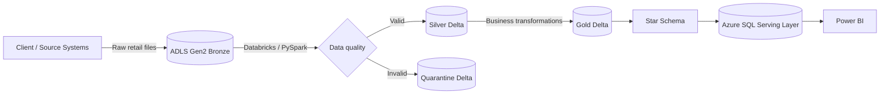

# Azure Retail Lakehouse & Sales Analytics Platform

End-to-end Azure Data Engineering + Power BI portfolio project implementing ingestion, incremental processing, Medallion Architecture, Delta Lake, data-quality quarantine, dimensional modeling, and an analytics serving layer.

## Architecture



### Source pattern implemented
1. The client/source system deposits `orders`, `customers`, `products`, and `stores` raw files directly into ADLS Gen2 Bronze.
2. Databricks/PySpark cleans, casts, standardizes, deduplicates, and validates Bronze data.
3. Valid records are persisted to Silver Delta; invalid records are routed to Quarantine with `rejection_reason`, `source_entity`, and `quarantine_timestamp`.
4. Silver Orders uses Delta `MERGE` keyed by `order_id`, updating only when `source.last_modified_ts > target.last_modified_ts`.
5. Silver datasets feed the Gold star schema: `dim_customer`, `dim_product`, `dim_store`, `dim_date`, and `fact_sales`.
6. ADF orchestrates Bronze→Silver, validation, Silver→Gold, Gold validation, and Gold→Azure SQL serving loads.
7. Gold dimensions are loaded before `fact_sales` so serving-layer foreign keys can be satisfied.
8. Power BI consumes the Azure SQL serving model.

> **Architecture decision:** There is no separate Landing layer and no Azure SQL `src_orders → Bronze` ingestion path.

## Repository

```text
adf/            ADF linked services, datasets, pipelines and trigger templates
databricks/     PySpark notebooks/scripts for Bronze→Silver→Gold + validation
sql/            Azure SQL serving DDL, indexes and validation queries
powerbi/        semantic model, DAX measures, connection and report design
tests/          DQ, Delta MERGE and reconciliation test plans
data/           source contracts and safe sample files
docs/           architecture, setup, deployment, runbook and interview guide
config/         environment placeholder configuration
```

## Project phases
- Phase 1 — Azure foundation and ADLS Bronze/Silver/Gold/Quarantine containers
- Phase 2 — Security, IAM and service connectivity
- Phase 3 — Client raw-file delivery directly into Bronze
- Phase 4 — Databricks Bronze→Silver processing + Quarantine
- Phase 5 — Delta MERGE for Orders + Silver validation
- Phase 6 — Silver→Gold dimensional/star-schema transformation
- Phase 7 — Gold validation
- Phase 8 — ADF Gold→Azure SQL serving load
- Phase 9 — Power BI semantic model, DAX and reporting
- Phase 10 — orchestration, monitoring, testing and operational runbook

## Pipeline orchestration

```text
TR_Retail_Daily
        ↓
PL_Retail_Lakehouse_Orchestration
        ↓
PL_Bronze_To_Silver
        ├── 01_Bronze_To_Silver_Orders
        ├── 02_Bronze_To_Silver_Customers
        ├── 03_Bronze_To_Silver_Products
        └── 04_Bronze_To_Silver_Stores
                    ↓
             05_Silver_Validation
                    ↓
             PL_Silver_To_Gold
                    ↓
             06_Silver_To_Gold
                    ↓
             07_Gold_Validation
                    ↓
           PL_Gold_To_AzureSQL
                    ↓
   dim_customer / dim_product / dim_store / dim_date
                    ↓
                fact_sales
                    ↓
                Azure SQL
                    ↓
                 Power BI
```

ADF dependency conditions act as validation gates: if Bronze→Silver or a validation notebook fails, downstream Gold and Azure SQL publication does not proceed.

## Security
No secrets are committed. Replace all `<...>` placeholders and use Managed Identity / Key Vault in a real environment.

## Key engineering concepts demonstrated
Azure Data Factory, ADLS Gen2, Azure SQL, Azure Databricks, PySpark, Delta Lake, Unity Catalog, Managed Identity, parameterized pipelines, Delta MERGE/upsert, incremental Order processing, deduplication, data-quality rules, quarantine handling, validation gates, Medallion Architecture, dimensional modeling, star schema, Power BI and DAX.